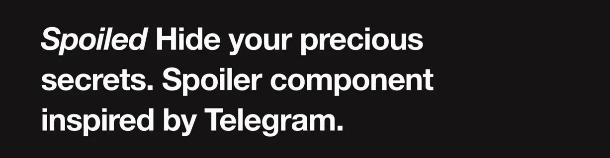

## Realistic `<Spoiler />` component for React

Inspired by [Telegram spoilers](https://telegram.org/blog/reactions-spoilers-translations#spoilers),
**spoiled** renders an animated particle cloud covering text, inline or block elements, keeping them
hidden until revealed.

- Uses **[CSS Painting API](https://caniuse.com/css-paint-api) (Houdini)** to achive realistic
  rendering for inline elements. Comes with a static image **fallback**;
- Supports **light/dark/system** mode;
- Animated **content transitions** (_fade/iris_), or custom;
- Respects `prefers-reduced-motion`;
- Control the performance: **FPS**, **density**, **color**, and more;

### How to use?

Install the package, requires React 18:

```jsx
npm i spoiled
```

Wrap your text in a spoiler, so the plot twists stay hidden:

```jsx
import { Spoiler } from "spoiled";

// Reveals on hover
<Spoiler>
  Hogwarts is a high-tech <b>startup incubator</b>
</Spoiler>;
```

By default, the spoiler:

- reveals on hover (uncontrolled)
- uses system color scheme
- wraps the content in a `span` element
- injects a small CSS for content transitions (please read below on how to opt out)

All standard props are proxied to the underlying `span` element. You can also use `tagName` prop to
change the tag:

```jsx
<Spoiler className="custom" aria-label="total secret">
  Neo opens a digital wellness retreat
</Spoiler>;

// You can hide blocks as well!
<Spoiler tagName="div">
  
</Spoiler>;
```

### Hiding and revealing the spoiler

`<Spoiler />` is uncontrolled and hidden by default. Use `revealOn` prop to either reveal the
content on click or hover:

```jsx
<Spoiler revealOn="click">Click me</Spoiler>;
<Spoiler revealOn="hover">Hover me</Spoiler>;

// Click to hide the spoiler
<Spoiler defaultHidden={false} revealOn="click">
  Frodo starts a ring-themed jewelry line
</Spoiler>;
```

We do, however, recommend passing `hidden` prop to control the spoiler state from your app:

```jsx
const [hidden, setHidden] = useState(true);

<Spoiler hidden={hidden} onClick={() => setHidden((s) => !s)} />;
```

### Theming

Spoiler adapts to the current color scheme, but you can also override the theme and the accent color
of the noise:

```jsx
/**
 * Theming
 */

<Spoiler /> // default theme is `system`
<Spoiler theme="dark" />
<Spoiler theme="light" />

/**
 * Custom primary color of the noise
 */

<Spoiler accentColor="red" />

// use an array of light and dark colors for
// dynamic accent color
<Spoiler accentColor={["black", "white"]} />
```

### Performance

**Spoiled** uses `IntersectionObserver` to stop the animation when the element leaves the viewport.
You can also use `fps` and `density` props to control the performance:

```jsx
// default FPS is 24, but it should look good at 16-20 as well
<Spoiler fps={16} />

// Default: 0.12
// Controls the number of particles rendered
// The higher, the more dense the noise
<Spoiler density={0.2}>Fat secret</Spoiler>
```

### Shape of words

When applied to inline elements, `<Spoiler />` will try to mimic the shape of the words in a
paragraph (faking spaces between words).

Since it can be inaccurate, use `mimicWords` setting to disable it:

```jsx
<Spoiler mimicWords={false}>This will be rendered as a solid line of text</Spoiler>
```

### Styling

Spoiled will on-demand inject a small `<style>` tag into the document with a CSS needed to animate
hide and reveal transitions. You can use an unstyled version instead and load these styles
differently.

```jsx
import { Spoiler } from "spoiled/no-css";

// If you're using Vite or similar bundler, these styles will be written to the final CSS bundle
import "spoiled/style.css";
```

## Disclaimer

As of 2024, [CSS Houdini API](https://caniuse.com/css-paint-api) is supported by the 70% of the
browsers (we do have a fallback though!). Animation may not be fluid and performant when used on
hude blocks of text.

Also, we don't guarantee that the secrets will stay hidden. Use at your own risk.
